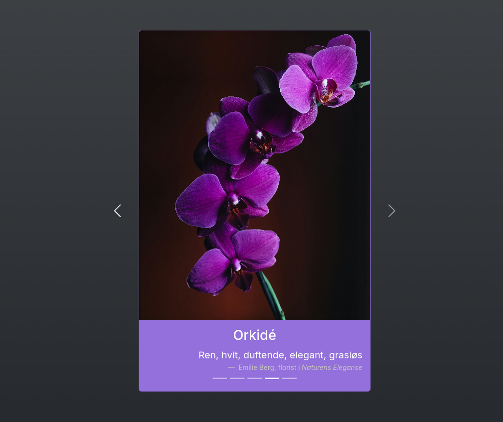

# Multi-focus assignment 1

## Task 1: Temperature Converter (Multi-task)


A simple web-based tool to convert between Fahrenheit, Celsius and Kelvin. Temperature conversion logic is handled on the server side using ASP.NET Core, with frontend interaction via HTML and Javascript.

## Features
- 🔄 Convert between Fahrenheit, Celsius and Kelvin
- 🛑 Input validation, including checks for absolute zero
- 💻 Responsive design with Bootstrap
- 📱 Unit selection (Fahrenheit, Celsius, Kelvin)

## Technical implementation:

**Frontend**:
- HTML5 form for input
- Bootstrap for layout

**Backend**:
- ASP.NET Core handles conversion and validation

**Interaction**:
- Convert temperature with button click
- Fetch conversion results via Javascript

---

## Task 2: Flower Carousel (Front-end focus)



A web-based flower carousel that showcases different flowers with their details, including descriptions, fun facts and artistic interpretations using Bootstrap and some CSS for styling.

## Features:
- 🌼 A carousel featuring various flower cards (rose, tulip, sunflower, orchid)
- 🖼️ Image and text content for each flower
- ✨ Smooth transitions with Bootstrap carousel
- 📱 Fully responsive design

## Technical implementation:

**Frontend**:
- HTML5 and Bootstrap for structure and styling
- CSS for custom styling and layout

**Functionality**:
- Carousel slides through flower cards
- Interactive front and back content for each flower

---

## Task 3: Team Management API (Back-End focus)

A simple web-based API that allows the creation and management of a sports team, including adding and updating players, deleting them and viewing player statistics. It also provides various features for retrieving and displaying team and player data using ASP.NET Core.

## Features:
- ⚙️ Create a team and add players
- 📝 Update player information
- ❌ Delete players from the team
- 🔎 Search for players by ID or ranking
- 📊 View team statistics such as average age, rank and player demographics
- 🧑‍🤝‍🧑 Fully dynamic player management (add, update, remove)
- 🖥️ Swagger UI for API interaction and testing (only in development)

## Technical implementation:

**Backend**:
- ASP.NET Core for API setup and routing
- In-memory data storage for team and player details
- Swagger for API documentation and testing
- OpenAPI for API specifications

**Functionality**:
- Create and manage a team with players
- Add, update or delete players based on their ID
- Search and filter player by rank or ID
- Retrieve detailed statistics about the team, including age and ranking distributions

---

## Setup

1. Clone the repository to your local machine
2. **Task 1 & Task 3**:
    - Open the project in your preferred IDE (e.g., Visual Studio Code)
    - Run the backend using the following command:
    ```bash
    dotnet watch
    ```
    - This will launch the web applications for **Task 1** and **Task 3**, and you can interact with them through your browser

3. **Task 2**:
    - Simply open `index.html` from the **Flower Carousel** folder in your browser to see the carousel in action

